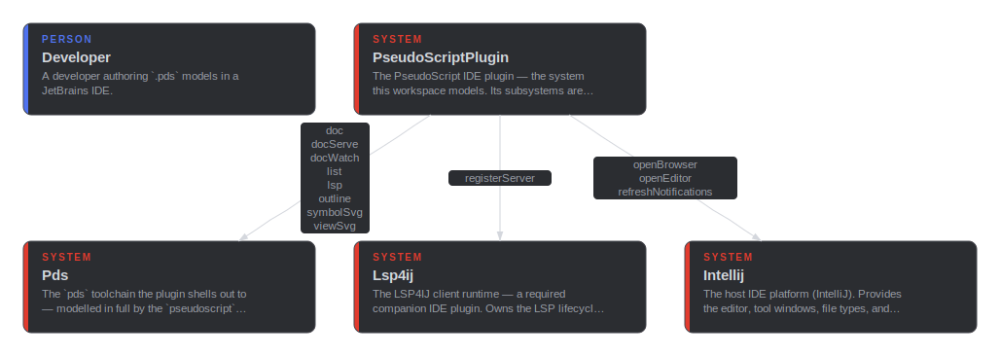

# PseudoScript IntelliJ Plugin

**System context**

## Modules

- [config](module/config.md) — 1 item
- [diagrams](module/diagrams.md) — 1 item
- [docs](module/docs.md) — 1 item
- [language](module/language.md) — 1 item
- [lsp](module/lsp.md) — 1 item
- [main](module/main.md) — 8 items

