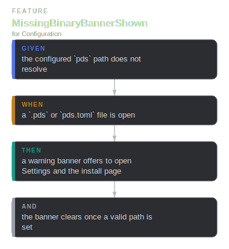
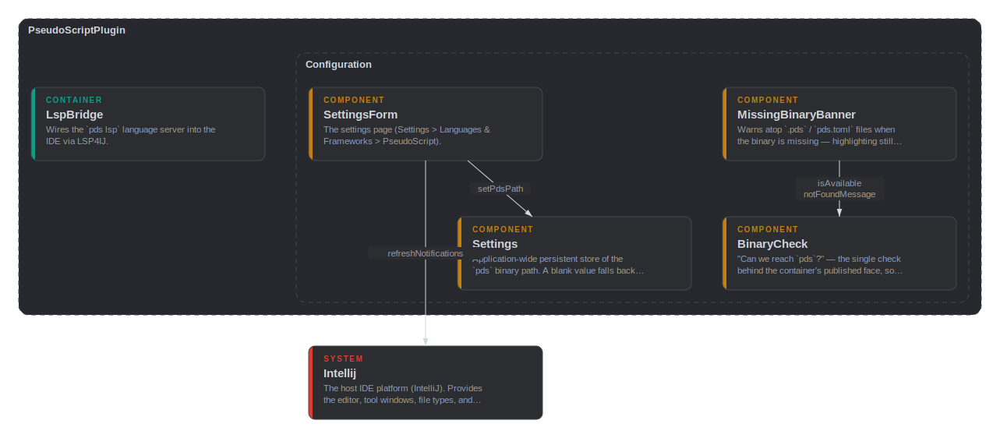
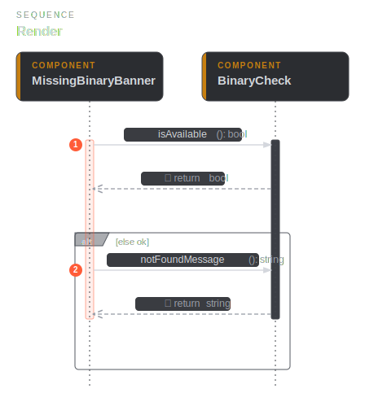
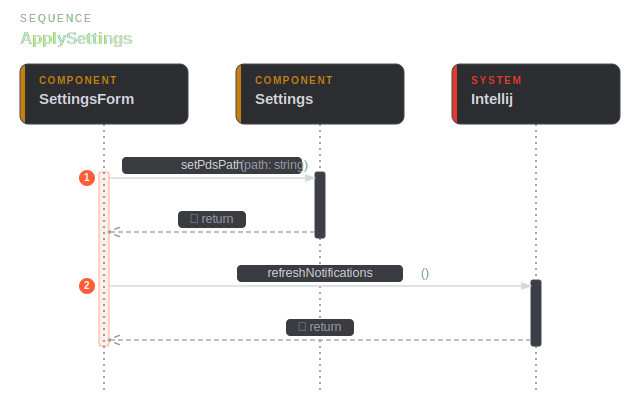

# config

## BinaryCheck

`private component` · `config::BinaryCheck`

"Can we reach `pds`?" — the single check behind the container's published
face, so the LSP launcher, the banner, and the diagram CLI wrapper all get
one consistent answer.

**Relationships**

- _Parent_
  - for [config::Configuration](config.md#config-Configuration)
- _Inbound_
  - call [config::Configuration](config.md#config-Configuration) — isAvailable
  - call [config::Configuration](config.md#config-Configuration) — notFoundMessage
  - call [config::MissingBinaryBanner](config.md#config-MissingBinaryBanner) — isAvailable
  - call [config::MissingBinaryBanner](config.md#config-MissingBinaryBanner) — notFoundMessage
- _Outbound_
  - from `config::bool`
  - from `config::string`

## Configuration

`public container` · `config::Configuration`

Settings, binary detection, and user-facing setup guidance. The availability
check is published here, on the container face, so the LSP launcher and the
banner couple to one facade rather than the engine behind it.

**Relationships**

- _Parent_
  - for [main::PseudoScriptPlugin](main.md#main-PseudoScriptPlugin)
- _Inbound_
  - call [lsp::LanguageServer](lsp.md#lsp-LanguageServer) — isAvailable
  - call [lsp::LanguageServer](lsp.md#lsp-LanguageServer) — notFoundMessage
- _Outbound_
  - call [config::BinaryCheck](config.md#config-BinaryCheck) — isAvailable
  - call [config::BinaryCheck](config.md#config-BinaryCheck) — notFoundMessage
  - from `lsp::bool`
  - from `lsp::string`

**Scenarios**

- **MissingBinaryBannerShown**
  - _given_ the configured `pds` path does not resolve
  - _when_ a `.pds` or `pds.toml` file is open
  - _then_ a warning banner offers to open Settings and the install page
  - _and_ the banner clears once a valid path is set

**Flow — MissingBinaryBannerShown**

**Component diagram**

## MissingBinaryBanner

`public component` · `config::MissingBinaryBanner`

Warns atop `.pds` / `pds.toml` files when the binary is missing — highlighting
still works, but diagnostics, diagrams, and docs need it.

**Relationships**

- _Parent_
  - for [config::Configuration](config.md#config-Configuration)
- _Outbound_
  - call [config::BinaryCheck](config.md#config-BinaryCheck) — isAvailable
  - call [config::BinaryCheck](config.md#config-BinaryCheck) — notFoundMessage

**Sequence — Render**

## Settings

`public component` · `config::Settings`

Application-wide persistent store of the `pds` binary path. A blank value
falls back to the bare name `pds`, resolved on PATH.

**Relationships**

- _Parent_
  - for [config::Configuration](config.md#config-Configuration)
- _Inbound_
  - call [config::SettingsForm](config.md#config-SettingsForm) — setPdsPath

## SettingsForm

`public component` · `config::SettingsForm`

The settings page (Settings > Languages & Frameworks > PseudoScript).

**Relationships**

- _Parent_
  - for [config::Configuration](config.md#config-Configuration)
- _Outbound_
  - call [config::Settings](config.md#config-Settings) — setPdsPath
  - call [main::Intellij](main.md#main-Intellij) — refreshNotifications

**Sequence — ApplySettings**

