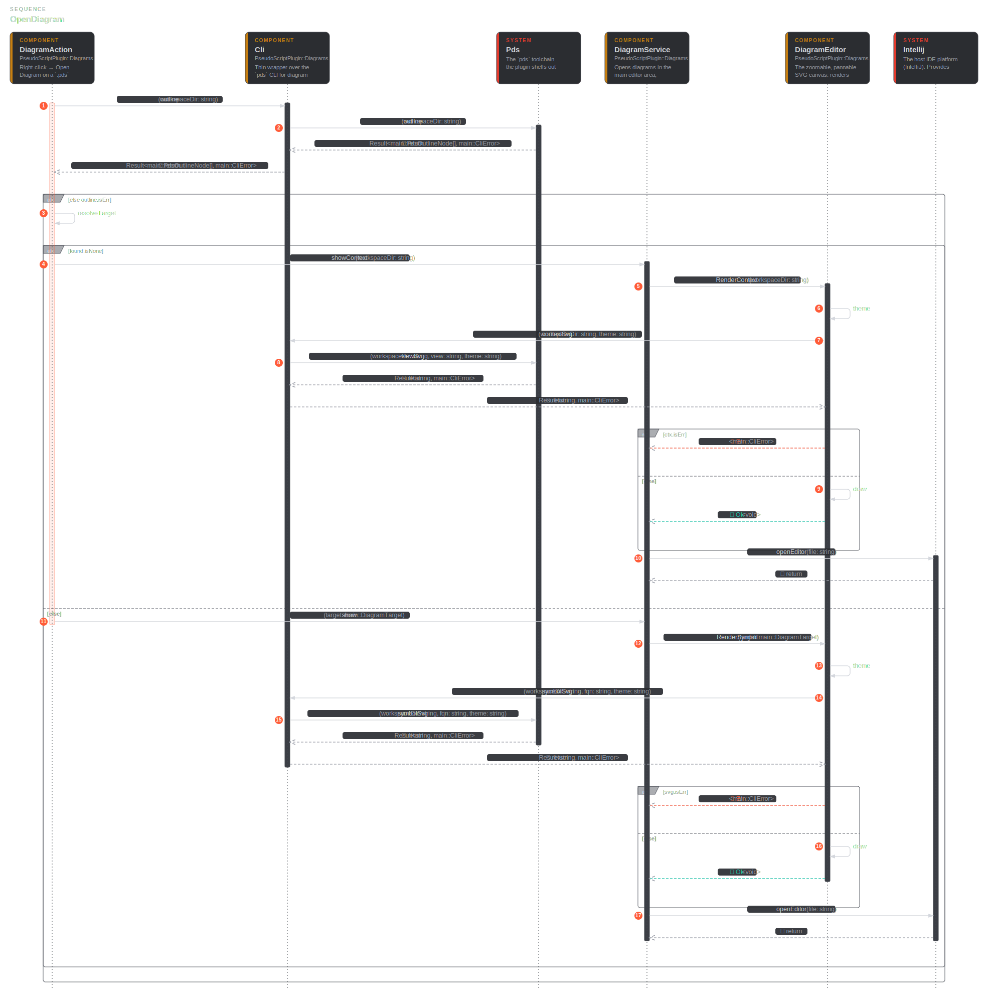
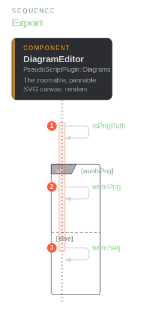
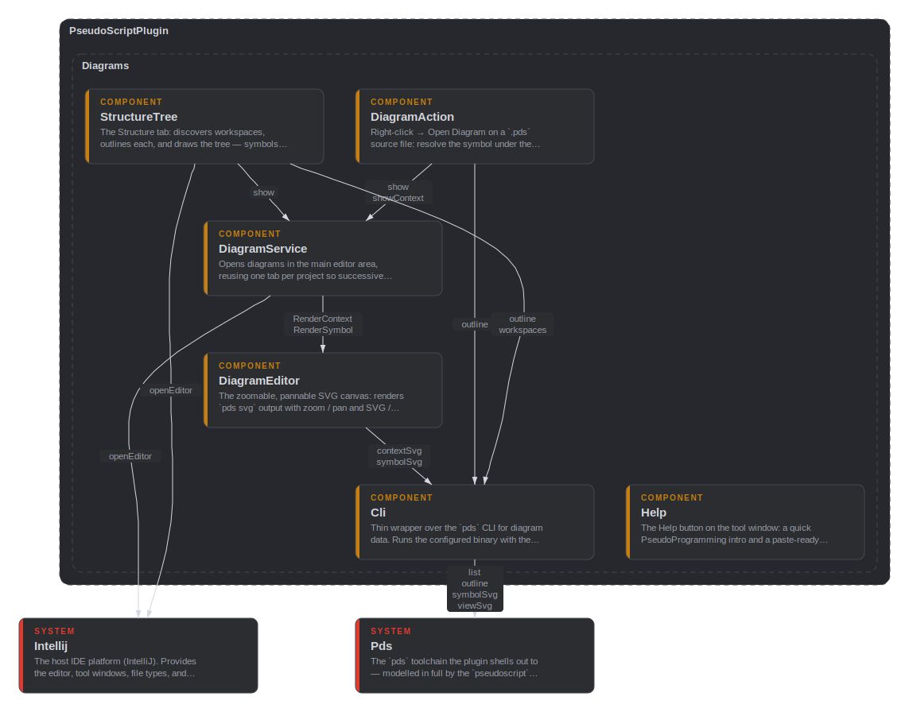
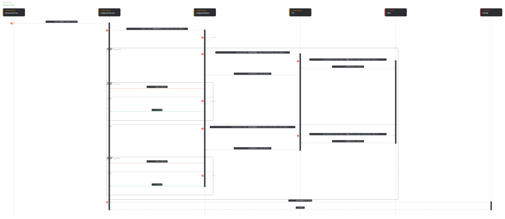
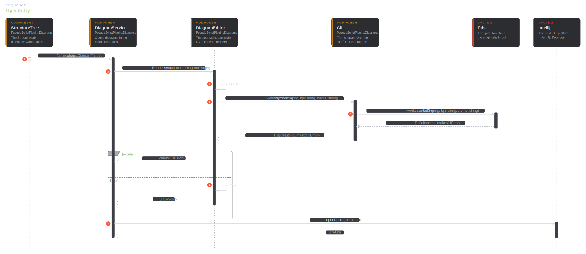

# diagrams

## Cli

`public component` · `diagrams::Cli`

Thin wrapper over the `pds` CLI for diagram data. Runs the configured binary
with the workspace as the working directory; every call returns a value for
the UI or a `CliError` (off the EDT — these block).

**Relationships**

- _Parent_
  - for [diagrams::Diagrams](diagrams.md#diagrams-Diagrams)
- _Inbound_
  - call [diagrams::StructureTree](diagrams.md#diagrams-StructureTree) — workspaces
  - call [diagrams::StructureTree](diagrams.md#diagrams-StructureTree) — outline
  - call [diagrams::DiagramEditor](diagrams.md#diagrams-DiagramEditor) — contextSvg
  - call [diagrams::DiagramEditor](diagrams.md#diagrams-DiagramEditor) — symbolSvg
  - call [diagrams::DiagramAction](diagrams.md#diagrams-DiagramAction) — outline
- _Outbound_
  - call [main::Pds](main.md#main-Pds) — list
  - call [main::Pds](main.md#main-Pds) — outline
  - call [main::Pds](main.md#main-Pds) — svg
  - call [main::Pds](main.md#main-Pds) — svg

## DiagramAction

`public component` · `diagrams::DiagramAction`

Right-click → Open Diagram on a `.pds` source file: resolve the symbol under
the caret and render it, falling back to the context view.

**Relationships**

- _Parent_
  - for [diagrams::Diagrams](diagrams.md#diagrams-Diagrams)
- _Outbound_
  - call [diagrams::Cli](diagrams.md#diagrams-Cli) — outline
  - call [diagrams::DiagramService](diagrams.md#diagrams-DiagramService) — show
  - call [diagrams::DiagramService](diagrams.md#diagrams-DiagramService) — show

**Sequence — OpenDiagram**

## DiagramEditor

`public component` · `diagrams::DiagramEditor`

The zoomable, pannable SVG canvas: renders `pds svg` output with zoom / pan
and SVG / PNG export, following the IDE's light / dark theme.

**Relationships**

- _Parent_
  - for [diagrams::Diagrams](diagrams.md#diagrams-Diagrams)
- _Inbound_
  - call [diagrams::DiagramService](diagrams.md#diagrams-DiagramService) — Render
- _Outbound_
  - call [diagrams::Cli](diagrams.md#diagrams-Cli) — contextSvg
  - call [diagrams::Cli](diagrams.md#diagrams-Cli) — symbolSvg

**Scenarios**

- **SelectingANodeRenders**
  - _given_ the structure tree is populated
  - _when_ the developer selects a symbol
  - _then_ a triggered flow renders as a sequence diagram
  - _and_ a structural node renders as its C4 view

**Sequence — Export**

## DiagramService

`public component` · `diagrams::DiagramService`

Opens diagrams in the main editor area, reusing one tab per project so
successive picks refresh the same view rather than spawning tabs.

**Relationships**

- _Parent_
  - for [diagrams::Diagrams](diagrams.md#diagrams-Diagrams)
- _Inbound_
  - call [diagrams::StructureTree](diagrams.md#diagrams-StructureTree) — show
  - call [diagrams::DiagramAction](diagrams.md#diagrams-DiagramAction) — show
  - call [diagrams::DiagramAction](diagrams.md#diagrams-DiagramAction) — show
- _Outbound_
  - call [diagrams::DiagramEditor](diagrams.md#diagrams-DiagramEditor) — Render
  - call [main::Intellij](main.md#main-Intellij) — openEditor

## Diagrams

`public container` · `diagrams::Diagrams`

The Structure tree and the SVG diagram editor, plus the right-click action and
the CLI wrapper that backs them.

**Relationships**

- _Parent_
  - for [main::PseudoScriptPlugin](main.md#main-PseudoScriptPlugin)

**Component diagram**

## StructureTree

`public component` · `diagrams::StructureTree`

The Structure tab: discovers workspaces, outlines each, and draws the tree;
selecting a node opens its diagram.

**Relationships**

- _Parent_
  - for [diagrams::Diagrams](diagrams.md#diagrams-Diagrams)
- _Outbound_
  - call [diagrams::Cli](diagrams.md#diagrams-Cli) — workspaces
  - call [diagrams::Cli](diagrams.md#diagrams-Cli) — outline
  - call [diagrams::DiagramService](diagrams.md#diagrams-DiagramService) — show

**Scenarios**

- **StructureTreeListsWorkspaces**
  - _given_ a repository holding one or more `pds.toml` workspaces
  - _when_ the Structure tab refreshes
  - _then_ each workspace's symbols appear, nested by their parent
  - _and_ flow entry points are marked distinctly from structural nodes

**Sequence — OpenEntry**

**Sequence — Refresh**

