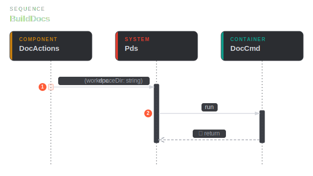
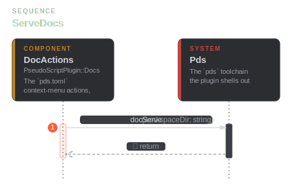
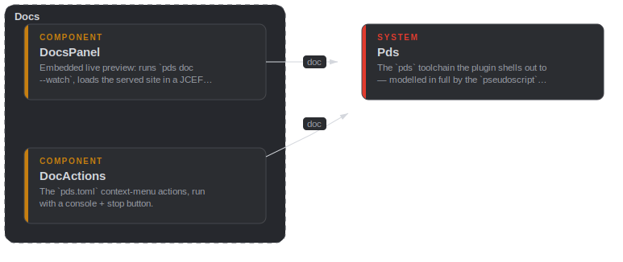
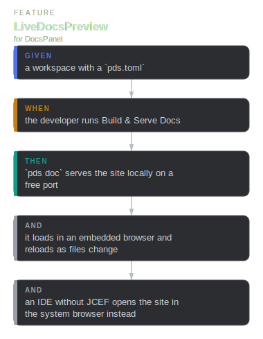
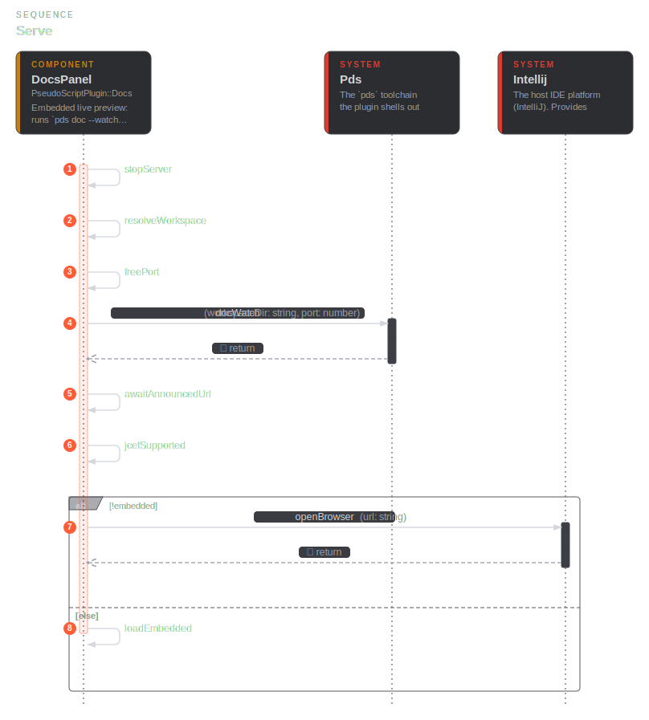

# docs

## DocActions

`public component` · `docs::DocActions`

The `pds.toml` context-menu actions, run with a console + stop button.

**Relationships**

- _Parent_
  - for [docs::Docs](docs.md#docs-Docs)
- _Outbound_
  - call [main::Pds](main.md#main-Pds) — doc
  - call [main::Pds](main.md#main-Pds) — docServe

**Sequence — BuildDocs**

**Sequence — ServeDocs**

## Docs

`public container` · `docs::Docs`

The Docs tab (live preview) and the Build / Serve Docs actions.

**Relationships**

- _Parent_
  - for [main::PseudoScriptPlugin](main.md#main-PseudoScriptPlugin)

**Component diagram**

## DocsPanel

`public component` · `docs::DocsPanel`

Embedded live preview: runs `pds doc --watch` on a free port, loads the
served site in a JCEF browser, and auto-reloads as the model changes. An IDE
without embedded-browser support falls back to the system browser.

**Relationships**

- _Parent_
  - for [docs::Docs](docs.md#docs-Docs)
- _Outbound_
  - from `docs::string`
  - from `docs::number`
  - call [main::Pds](main.md#main-Pds) — docWatch
  - from `docs::string`
  - from `docs::bool`
  - call [main::Intellij](main.md#main-Intellij) — openBrowser

**Scenarios**

- **LiveDocsPreview**
  - _given_ a workspace with a `pds.toml`
  - _when_ the developer runs Build & Serve Docs
  - _then_ `pds doc` serves the site locally on a free port
  - _and_ it loads in an embedded browser and reloads as files change
  - _and_ an IDE without JCEF opens the site in the system browser instead

**Flow — LiveDocsPreview**

**Sequence — Serve**

