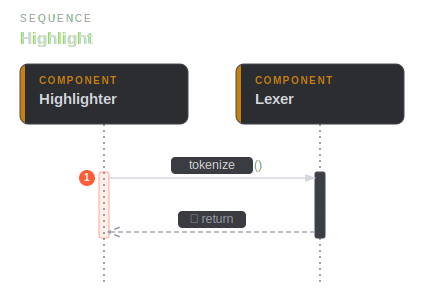
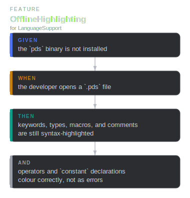
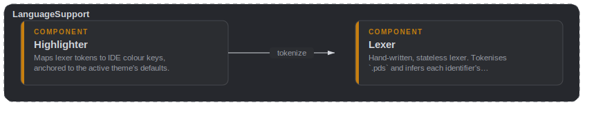

# language

## Highlighter

`public component` · `language::Highlighter`

Maps lexer tokens to IDE colour keys, anchored to the active theme's
defaults. The role tokens map to the same colour keys the LSP semantic
overlay uses (`lsp::SemanticTokens`), so the file looks the same with or
without the server.

**Relationships**

- _Parent_
  - for [language::LanguageSupport](language.md#language-LanguageSupport)
- _Outbound_
  - call [language::Lexer](language.md#language-Lexer) — tokenize

**Sequence — Highlight**

## LanguageSupport

`public container` · `language::LanguageSupport`

Registers `.pds` as a language and paints it from the lexer alone — the one
capability that does not depend on the external toolchain.

**Relationships**

- _Parent_
  - for [main::PseudoScriptPlugin](main.md#main-PseudoScriptPlugin)

**Scenarios**

- **OfflineHighlighting**
  - _given_ the `pds` binary is not installed
  - _when_ the developer opens a `.pds` file
  - _then_ keywords, types, macros, and comments are still syntax-highlighted
  - _and_ operators and `constant` declarations colour correctly, not as errors

**Flow — OfflineHighlighting**

**Component diagram**

## Lexer

`public component` · `language::Lexer`

Hand-written, stateless lexer, conformant with the language's lexical layer
(LANG.md §2): keywords (including `constant`), primitive type names, the full
§7.5 operator set with two-character operators (`==` `!=` `<=` `>=` `&&` `||`)
winning over their one-character prefixes, string/number literals, the four
comment flavours, and a whole `#[..]` macro as one span. It also infers each
identifier's same-line semantic role — namespace, type, callable, member,
union variant, constant name — by lookback, so the offline colours line up
with what `pds lsp` later refines.

**Relationships**

- _Parent_
  - for [language::LanguageSupport](language.md#language-LanguageSupport)
- _Inbound_
  - call [language::Highlighter](language.md#language-Highlighter) — tokenize

