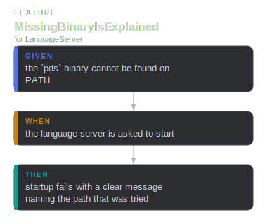
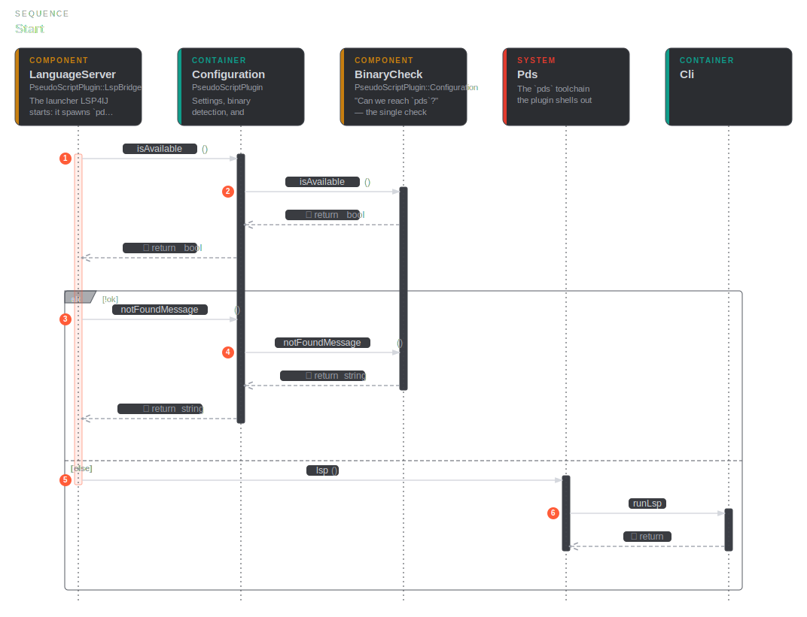
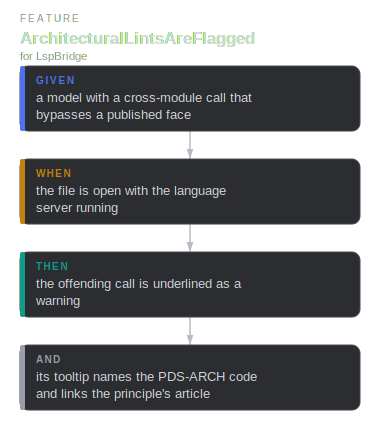
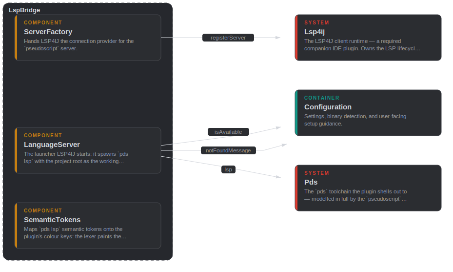
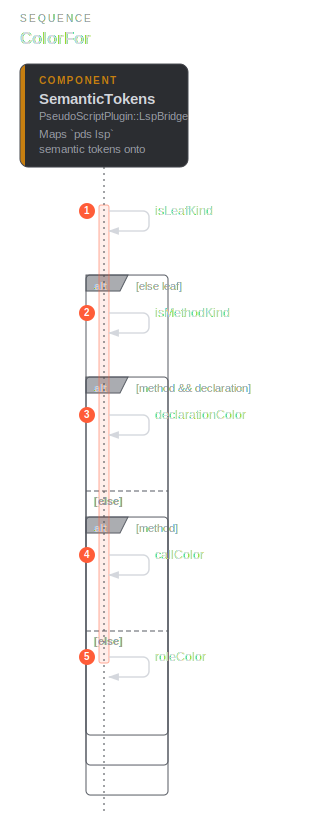
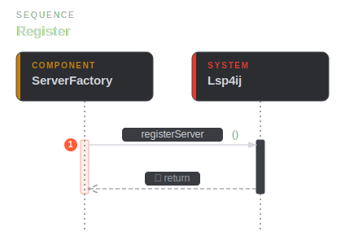

# lsp

## LanguageServer

`public component` · `lsp::LanguageServer`

The launcher LSP4IJ starts: it spawns `pds lsp` with the project root as the
working directory so the server resolves `pds.toml` and workspace FQNs.

**Relationships**

- _Parent_
  - for [lsp::LspBridge](lsp.md#lsp-LspBridge)
- _Outbound_
  - call [config::Configuration](config.md#config-Configuration) — isAvailable
  - call [config::Configuration](config.md#config-Configuration) — notFoundMessage
  - call [main::Pds](main.md#main-Pds) — lsp

**Scenarios**

- **MissingBinaryIsExplained**
  - _given_ the `pds` binary cannot be found on PATH
  - _when_ the language server is asked to start
  - _then_ startup fails with a clear message naming the path that was tried

**Flow — MissingBinaryIsExplained**

**Sequence — Start**

## LspBridge

`public container` · `lsp::LspBridge`

Wires the `pds lsp` language server into the IDE via LSP4IJ.

**Relationships**

- _Parent_
  - for [main::PseudoScriptPlugin](main.md#main-PseudoScriptPlugin)

**Scenarios**

- **ArchitecturalLintsAreFlagged**
  - _given_ a model with a cross-module call that bypasses a published face
  - _when_ the file is open with the language server running
  - _then_ the offending call is underlined as a warning
  - _and_ its tooltip names the PDS-ARCH code and links the principle's article

**Flow — ArchitecturalLintsAreFlagged**

**Component diagram**

## SemanticTokens

`public component` · `lsp::SemanticTokens`

Maps `pds lsp` semantic tokens onto the plugin's colour keys. The two layers
must agree, so each owns what it knows best: the lexer paints the base layer,
the server refines only what needs resolution — an identifier's role.

**Relationships**

- _Parent_
  - for [lsp::LspBridge](lsp.md#lsp-LspBridge)
- _Outbound_
  - from `lsp::bool`
  - from `lsp::bool`

**Sequence — ColorFor**

## ServerFactory

`public component` · `lsp::ServerFactory`

Hands LSP4IJ the connection provider for the `pseudoscript` server.

**Relationships**

- _Parent_
  - for [lsp::LspBridge](lsp.md#lsp-LspBridge)
- _Outbound_
  - call [main::Lsp4ij](main.md#main-Lsp4ij) — registerServer

**Sequence — Register**

