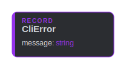
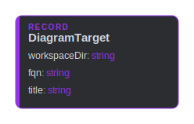
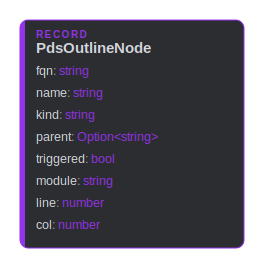

# main

## CliError

`public data` · `main::CliError`

The message side of a failed `pds` invocation (timeout, non-zero exit, or a
JSON parse failure) — surfaced to the UI as status text.

**Entity diagram**

## Developer

`public person` · `main::Developer`

A developer authoring `.pds` models in a JetBrains IDE.

## DiagramTarget

`public data` · `main::DiagramTarget`

What the (single, reused) diagram tab shows: the workspace to render against
and the symbol whose fitting view is drawn. `title` is the human label for
the tab. The whole-workspace context view is requested separately
(`diagrams::DiagramService.showContext`), so it carries no symbol.

**Entity diagram**

## Intellij

`public system` · `main::Intellij`

The host IDE platform (IntelliJ). Provides the editor, tool windows, file
types, and process execution; the plugin registers into it and calls back to
its services. Everything inside is the platform's, not ours.

**Relationships**

- _Inbound_
  - call [config::SettingsForm](config.md#config-SettingsForm) — refreshNotifications
  - call [diagrams::StructureTree](diagrams.md#diagrams-StructureTree) — openEditor
  - call [diagrams::DiagramService](diagrams.md#diagrams-DiagramService) — openEditor
  - call [diagrams::DiagramService](diagrams.md#diagrams-DiagramService) — openEditor
  - call [docs::DocsPanel](docs.md#docs-DocsPanel) — openBrowser

**Container diagram**

## Lsp4ij

`public system` · `main::Lsp4ij`

The LSP4IJ client runtime — a required companion IDE plugin. Owns the LSP
lifecycle and routes `pds lsp` diagnostics / hover / completion / semantic
tokens to the editor.

**Relationships**

- _Inbound_
  - call [lsp::ServerFactory](lsp.md#lsp-ServerFactory) — registerServer

**Container diagram**

## Pds

`public system` · `main::Pds`

`##critical`

The `pds` toolchain the plugin shells out to — modelled in full by the
`pseudoscript` dependency. `lsp` and `doc` delegate to the upstream container's
published face (`pseudoscript::cli::Cli.runLsp` / `runDoc`); the JSON/SVG query
commands the plugin parses (`outline`/`list`/`svg`) stay signature-only here,
since the upstream face does not publish them.

Invoked the same way everywhere: the configured binary (PATH name or absolute
path) run with the workspace directory as the working directory, so it finds
`pds.toml` and resolves workspace FQNs. The parsed query commands
(`outline`/`list`/`svg`) are capped at `diagrams::TIMEOUT_MS` before the
plugin declares them hung; the server modes (`lsp`, `doc` serving) run until
stopped.

**Relationships**

- _Inbound_
  - call [diagrams::Cli](diagrams.md#diagrams-Cli) — list
  - call [diagrams::Cli](diagrams.md#diagrams-Cli) — outline
  - call [diagrams::Cli](diagrams.md#diagrams-Cli) — symbolSvg
  - call [diagrams::Cli](diagrams.md#diagrams-Cli) — viewSvg
  - call [docs::DocsPanel](docs.md#docs-DocsPanel) — docWatch
  - call [docs::DocActions](docs.md#docs-DocActions) — doc
  - call [docs::DocActions](docs.md#docs-DocActions) — docServe
  - call [lsp::LanguageServer](lsp.md#lsp-LanguageServer) — lsp
- _Outbound_
  - from `diagrams::Result`
  - call `pseudoscript::cli::Cli` — runLsp
  - call `pseudoscript::cli::Cli` — runDoc

**Container diagram**

## PdsOutlineNode

`public data` · `main::PdsOutlineNode`

One node of `pds outline` — the structure-tree payload. `kind` is one of
person / system / container / component / data / callable / feature;
`triggered` marks a flow entry point (a callable with a trigger macro).

**Entity diagram**

## PseudoScriptPlugin

`public system` · `main::PseudoScriptPlugin`

The PseudoScript IDE plugin — the system this workspace models. Its subsystems
are declared as containers in the per-package modules.

**Container diagram**

