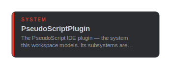
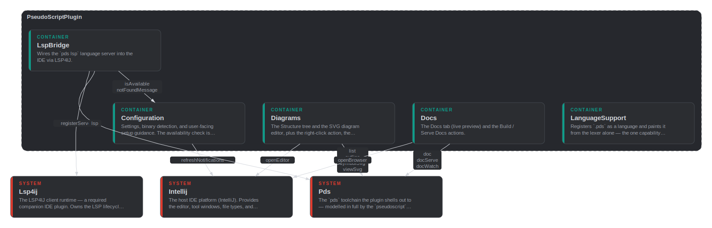

# main

## CliError

`public data` · `main::CliError`

The message side of a failed `pds` invocation (timeout, non-zero exit, or a
JSON parse failure) — surfaced to the UI as status text.

## Developer

`public person` · `main::Developer`

A developer authoring `.pds` models in a JetBrains IDE.

## DiagramTarget

`public data` · `main::DiagramTarget`

What a diagram tab currently shows: the workspace to render against, and
either a symbol FQN (its fitting view) or none (the whole-workspace context
view). `title` is the human label for the toolbar.

## Intellij

`public system` · `main::Intellij`

The host IDE platform (IntelliJ). Provides the editor, tool windows, file
types, and process execution; the plugin registers into it and calls back to
its services. Everything inside is the platform's, not ours.

**Relationships**

- _Inbound_
  - call [config::SettingsForm](config.md#config-SettingsForm) — refreshNotifications
  - call [diagrams::DiagramService](diagrams.md#diagrams-DiagramService) — openEditor

**Container diagram**

## Lsp4ij

`public system` · `main::Lsp4ij`

The LSP4IJ client runtime — a required companion IDE plugin. Owns the LSP
lifecycle and routes `pds lsp` diagnostics / hover / completion to the editor.

**Relationships**

- _Inbound_
  - call [lsp::ServerFactory](lsp.md#lsp-ServerFactory) — registerServer

**Container diagram**

## Pds

`public system` · `main::Pds`

`##critical`

The `pds` toolchain the plugin shells out to — modelled in full by the
`pseudoscript` dependency. `lsp` and `doc` delegate to that upstream model
(`pseudoscript::cli::LspHost` / `DocCmd`); the JSON/SVG query commands the
plugin parses (`outline`/`list`/`svg`) stay signature-only here, since the
upstream model does not expose them as nodes.

Invoked the same way everywhere: the configured binary (PATH name or absolute
path) run with the workspace directory as the working directory, so it finds
`pds.toml` and resolves workspace FQNs.

**Relationships**

- _Inbound_
  - call [diagrams::Cli](diagrams.md#diagrams-Cli) — list
  - call [diagrams::Cli](diagrams.md#diagrams-Cli) — outline
  - call [diagrams::Cli](diagrams.md#diagrams-Cli) — svg
  - call [diagrams::Cli](diagrams.md#diagrams-Cli) — svg
  - call [docs::DocsPanel](docs.md#docs-DocsPanel) — doc
  - call [docs::DocActions](docs.md#docs-DocActions) — doc
  - call [docs::DocActions](docs.md#docs-DocActions) — doc
  - call [lsp::LanguageServer](lsp.md#lsp-LanguageServer) — lsp
- _Outbound_
  - call `pseudoscript::cli::LspHost` — run
  - call `pseudoscript::cli::DocCmd` — run

**Container diagram**

## PdsOutlineNode

`public data` · `main::PdsOutlineNode`

One node of `pds outline` — the structure-tree payload. `kind` is one of
person / system / container / component / data / callable; `triggered` marks a
flow entry point (a callable with a trigger macro).

## PseudoScriptPlugin

`public system` · `main::PseudoScriptPlugin`

The PseudoScript IDE plugin — the system this workspace models. Its subsystems
are declared as containers in the per-package modules.

**Container diagram**

